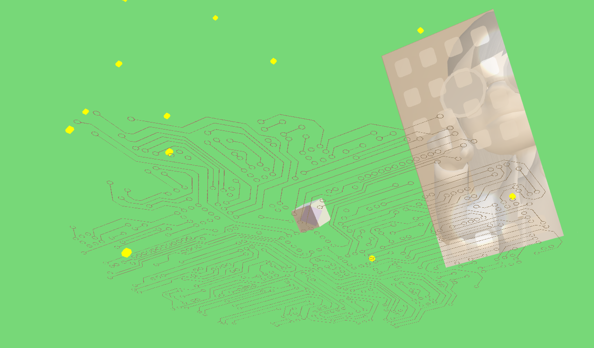

# A Web Packets Journey

( check out our [teaser trailer](https://vimeo.com/292170651) on vimeo )

A Web Packet's Journey is an online ( desktop, mobile, cardboard and WebVR ) educational interactive-narrative/game based on the route a web request packet takes over the Internet, in 10 parts:

- Part I: the reQuest
- Part II: the Daemon at the Gateway
- Part III: the Last Mile
- Part IV: the Fiber Express
- Part V: 未来 (Mirai)
- Part VI: 157.240.2.35
- Part VII: the Carrier Hotel
- Part VIII: 100 Terabits Under the Sea
- Part IX: a Trip to the Center of the Web
- Part X: the Response

It is still very much in development. questions/thoughts let us@brangerbriz.com know.
